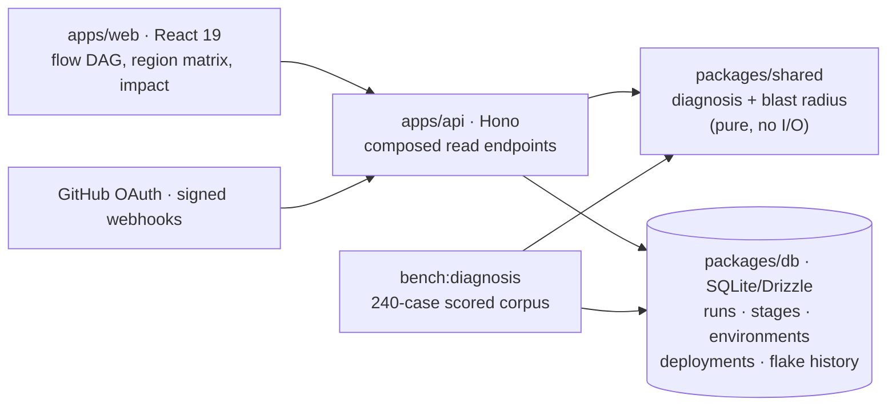

# CodeLens

**Root-cause analysis for CI/CD pipelines.** When a pipeline goes red, CodeLens
reads the stage logs, the run history and the deploy topology, and tells you
*why* — which region, which branch, which commit, which test — and whether your
change is even to blame.

> **[Open the live demo →](https://codelens-96py.onrender.com/demo)**
> No sign-in. Drops straight into a seeded five-service monorepo with 41 real
> pipeline runs across three production regions.

---

## The problem

CI gives you an exit code and ten thousand lines of log. Deciding whether you
are actually blocked means reading them, comparing against yesterday's run,
checking whether the failing test is a known flake, and noticing that only one
region failed. That is archaeology, and it happens on every red build.

Three questions are hard specifically because a single run does not contain the
answer:

| Question | Why it's hard | What CodeLens does |
| --- | --- | --- |
| Why is it red? | An assertion failure, an OOM kill and a rejected credential all exit 1 | Classifies the failure into one of 8 root causes with the evidence that produced the verdict |
| Is my change at fault? | A flake and a regression look identical in one run — the difference is only visible across branches over time | Uses per-test flake history and cross-branch spread to clear or convict the commit |
| What does this change touch? | The diff shows what changed, not what depends on it | Walks the repository's import graph backwards to find every downstream file, service and endpoint |

## Measured results

Every number here is produced by committed code, not estimated. The command to
reproduce each one is in the row.

| Metric | Value | Reproduce |
| --- | --- | --- |
| Root-cause accuracy | **95.8%** over 240 labelled failures | `pnpm --filter @codelens/api bench:diagnosis` |
| — on the adversarial subset | **88.9%** over 90 cases with a decoy signal | same |
| — log-pattern matching alone | **75.0%** (−20.8pp) | ablation, printed by the same command |
| Classification latency | **p95 under 0.1ms**, no model call | same |
| Blast radius traversal | **32 files / 4 services / 10 endpoints** from one leaf module, in single-digit ms | demo → Change impact |
| Test suite | **50 tests** across the engine, the API and integration | `pnpm test` |

### Read the accuracy number honestly

The benchmark corpus is synthetic and was authored alongside the rules, so
95.8% is an **upper bound, not a field result**. The product says so on its own
benchmark page. The parts that survive that objection are:

- **The ablation.** Withholding evidence sources and re-scoring shows what each
  input is actually worth: log patterns alone reach 75.0%, flake history is
  worth +9.6pp, region topology +8.3pp. A bare accuracy figure cannot
  distinguish a good model from an easy test set; this can.
- **The adversarial split.** 90 of the 240 cases carry a decoy — a runner
  OOM-killed while assertions were failing, a 401 arriving during a
  config-driven outage, a regression in a file that also owns a known flake.
  Accuracy there is 88.9%.
- **The failures are published.** Every misclassification is listed on the
  benchmark page. Most are the engine declining to guess on genuinely contested
  cases rather than asserting a cause it cannot support.
- **A regression gate.** The benchmark CLI exits non-zero below 85%, so the
  number cannot silently rot.

## How the diagnosis engine works

`packages/shared/src/diagnosis.ts` is a pure, dependency-free module. It takes a
`FailureContext` — one stage's log, the run's branch and diff, and the relevant
history — and returns a verdict with its supporting evidence.

**1. Signals.** Five readers extract evidence, each tagged with its provenance:

| Source | Reads | Example signal |
| --- | --- | --- |
| `log` | 15 ordered log signatures | `oom-kill`, `auth-expired`, `dep-resolution` |
| `history` | per-test flake rates, cross-branch spread, previous run status | `all-failures-known-flaky`, `branch-was-green` |
| `topology` | sibling deploy results per region, config divergence | `region-isolated-failure` |
| `diff` | changed paths vs. failing modules | `diff-touches-failing-area` |
| `metrics` | runner memory/disk, duration vs. baseline | `runner-memory-saturated` |

**2. Combination.** Weights per category combine with **noisy-OR**
(`1 - ∏(1 - wᵢ)`) rather than a sum, so two 0.6 signals read as "very likely"
(0.84) instead of "impossible" (1.2), and diminishing returns come for free.

**3. Suppression.** This is the part that makes it work. Some evidence rules a
cause *out*, and without that the engine confuses flakes and regressions
constantly — both accumulate "tests failed" evidence. For example:

```ts
// A process killed by the runtime reports every unfinished test as
// failed, so its test results carry almost no information.
'oom-kill': { 'code-regression': 0.35, 'flaky-test': 0.5 },
// Known-flaky across branches means this diff is not the cause.
'all-failures-known-flaky': { 'code-regression': 0.3 },
```

Adding those three OOM suppressions moved accuracy on the adversarial subset
from 83.3% to 100% — the assertion noise from a half-run suite had been
outweighing the single kill line that actually explained the failure.

**4. Confidence.** Discounted by how close the runner-up is, so a 0.7-vs-0.1
call and a 0.7-vs-0.68 coin flip are not reported with equal certainty. Below a
floor the engine returns `unknown` rather than guessing.

The result ships the signals that supported the verdict **and** the ones that
argued against it, so a reader can check the reasoning instead of trusting a
score.

## Architecture



The engine has no database or network dependency, which is what lets the same
code path serve the API and the scoring harness. That is the reason the accuracy
number describes the shipped product rather than a separate script.

**Design decisions worth noting**

- **One composed endpoint per screen.** `/delivery-overview` returns
  environments, pipelines, runs and derived stats in a single request. The
  screen is useless partially loaded, so a waterfall of six calls buys nothing.
- **The DAG is a real graph.** Stages carry `sequence`, `lane` and `dependsOn`,
  so parallel region deploys share a level and render side by side. Laying them
  out as a list would destroy the comparison the product exists to make.
- **Layout is computed, not measured.** Node positions are pure functions of
  `(sequence, lane)`, so SVG edges are correct on first paint with no
  `ResizeObserver` and no reflow pass.
- **Impact travels backwards.** The import graph points the way code reads;
  risk propagates the other way, so every traversal runs over the reversed
  graph. BFS means `depth` and the path back to the diff are correct in one
  pass.
- **Risk scores are decomposable.** Additive and capped, with every point
  traceable to a stated reason. An opaque 0–100 gets ignored after a week.

## Run it locally

Requires Node.js 22+ and Git. pnpm is pinned through Corepack.

```sh
corepack pnpm install
corepack pnpm run setup          # migrate + seed the demo workspace
corepack pnpm dev                # web on :3000, API on :4000
```

Open <http://localhost:3000/demo> for the seeded workspace. No account needed.

```sh
corepack pnpm test               # 50 tests: engine, API, integration
corepack pnpm bench              # score the diagnosis benchmark
corepack pnpm typecheck
corepack pnpm build
```

| Command | Purpose |
| --- | --- |
| `pnpm run setup` | Run migrations, then seed the demo repository |
| `pnpm db:seed:demo` | Rebuild only the demo workspace (idempotent) |
| `pnpm bench` | Re-score the classifier and print the ablation |
| `pnpm start` | Validate config, migrate, serve the built app on one port |
| `pnpm check:config` | Validate production environment without printing secrets |

The demo seed is deterministic — a fixed PRNG seed means the same repository,
graph, run history and verdicts on every machine. Diagnoses are **not** authored
in the seed: every failed run builds a `FailureContext` and calls the real
classifier, so what the demo shows is what the engine produced.

## What's real and what isn't

Being precise about this matters more than the feature list.

**Real:**

- The diagnosis engine, its benchmark, the ablation and the accuracy gate.
- The blast-radius traversal, risk scoring and coverage-gap detection.
- GitHub OAuth, encrypted token storage, signed per-repository webhooks,
  repository ownership boundaries, cookie sessions with CSRF protection.
- Repository indexing: revision-scoped files, compiler-based JS/TS symbols,
  import-graph extraction. Connect a real repository and the same analysis runs
  on your code.
- Release Rehearsal, under **More tools** — executes the prepared TaskForge
  fixture over real HTTP with SQL instrumentation and measures p95 latency and
  query counts. It caught a 2 → 22 query N+1 regression, which is asserted in
  the test suite.

**Seeded, and labelled as such in the UI:**

- The `northwind/commerce-platform` demo repository, its 41 pipeline runs and
  its three production regions. The demo banner says so on every screen.
- The benchmark corpus is synthetic, as discussed above.

**Not built:**

- No live GitHub Actions ingestion — webhooks are received and verified, but the
  pipeline model is populated by the seed rather than by polling the Actions
  API. That is the next piece of work, and the schema is shaped for it.
- The runtime executor only supports the prepared TaskForge fixture, not
  arbitrary repository builds.
- PostgreSQL and Playwright journeys have runnable configuration but are
  verified only against SQLite locally.

## Repository layout

```
apps/
  web/        React 19 SPA — flow DAG, region matrix, impact, benchmark
  api/        Hono API + diagnosis benchmark harness
  edge/       Cloudflare Worker/D1 deployment path
  extension/  Chrome extension for in-GitHub context
packages/
  shared/     diagnosis.ts, blast-radius.ts — pure domain logic
  db/         Drizzle schema, idempotent migrations, deterministic seed
  ai/         provider interface (Gemini / Ollama / deterministic)
  events/     in-process event bus
examples/
  taskforge/  instrumented fixture app for Release Rehearsal
```

## Further reading

- [Architecture, execution model and limitations](docs/release-platform.md)
- [Deployment, OAuth and environment setup](docs/deploy-full-workspace.md)
- [Tests and verification results](docs/verification.md)
- [Résumé claims and where each number comes from](docs/resume-claims.md)
