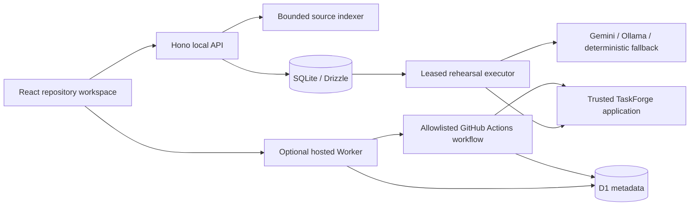

# CodeLens

CodeLens helps developers understand their repositories and verify how code changes affect application behavior and performance.

Create an account with email/password or GitHub OAuth, connect your GitHub repositories, choose a live branch, and index its latest commit. Inspect source and symbols, ask source-grounded questions, compare changes, follow real CI/CD and security evidence, and prepare reviewed draft pull requests. **Release Rehearsal** adds measured behavior/performance investigations for the prepared TaskForge application.

**Ready to host it? Start with [Full workspace deployment, OAuth and environment setup](docs/deploy-full-workspace.md) and [.env.production.example](.env.production.example).** The full Node app and the public Cloudflare demo have different capabilities; the guide explains both.

**Start the product tour on the landing page.** The recorded investigation is public; personal workspace pages require sign-in. Connect a repository → select and index a branch → explore its file tree and ask about selected lines → inspect file connections and review suggestions → compare commits through the guided investigation → prepare a reviewed change. See [the demonstration walkthrough](docs/recruiter-demo.md) for a short problem-to-evidence presentation.

## Start locally

Requires Node.js 22+ and Git. The workspace pins pnpm through Corepack.

```sh
corepack pnpm install --frozen-lockfile
corepack pnpm run setup
corepack pnpm dev
```

Open [the workspace](http://127.0.0.1:3010). Hono runs on port 4000. The default provider is deterministic and requires no key. Copy `.env.example` to `.env` for optional configuration.

The homepage explains the problem and the workflow. Sign up to manage your own repositories, then connect GitHub from **Account & GitHub**. **Investigations** offers two paths: a guided comparison for your own repository, or the completed TaskForge example. The example needs no login, Gemini, Docker or fresh execution. Recorded results are labeled with their actual timestamp and database engine.

If default ports are occupied, run the API with `PORT=4010` and Vite with `API_PROXY_TARGET=http://127.0.0.1:4010` and `--port 3010`. Environment variable syntax depends on the shell.

## What works

- Email/password and GitHub OAuth accounts, persisted cookie sessions, encrypted GitHub tokens, and repository ownership boundaries.
- Account repository selection, live GitHub branch discovery, branch-aware latest indexing, and confirmed deletion of local repository data.
- Saved own-repository investigations, exact-commit CI matching, workflow job/step inspection, deployments, PR mergeability, security alerts, and signed per-repository webhooks.
- Reviewed source/workflow edits published as new branches and draft pull requests, with stale-base protection and retry deduplication.
- Revision-scoped source files, compiler-based JS/TS symbols, partial relative-import navigation, indexing progress, historical snapshots, heuristic static findings, and navigable source citations.
- TaskForge baseline/candidate/correction comparisons using actual HTTP requests, seeded data and SQL instrumentation. The prepared defective version exposes a permission regression, repeated database queries and background-work contention.
- Two warmup-separated measurement repetitions, achieved throughput, errors, request traces, query counts/durations, and explicit inconclusive timing outcomes.
- One bounded investigator with configurable Gemini support through the existing provider interface. Deterministic execution/reporting continues when AI is unavailable.
- Worker configuration experiments, held-out validation, repository-linked findings and reports.
- Transactional run creation, idempotency, leases, completed checkpoints, bounded retries, cancellation and interrupted-stage recovery.
- A responsive React workspace, recorded demo bundle, and a separate Cloudflare Worker/D1 + trusted GitHub Actions deployment path.

The runtime executor supports **only the prepared TaskForge application**, not arbitrary repository builds. Other authorized public/private repositories support source intelligence and GitHub CI investigations. SQLite is the locally verified fixture engine; PostgreSQL and optional Playwright journeys have runnable configuration and must be verified in the target environment.

## Commands

| Command | Purpose |
| --- | --- |
| `corepack pnpm dev` | Migrate/seed and start the local workspace |
| `corepack pnpm typecheck` | Check workspace TypeScript |
| `corepack pnpm test` | Run API integration and event-bus tests |
| `corepack pnpm build` | Build React and Hono |
| `corepack pnpm check:config` | Validate the production environment without printing secrets |
| `corepack pnpm start` | Validate, migrate, and serve the full production app |
| `corepack pnpm verify:production` | Verify production routing and authentication in an isolated database |
| `corepack pnpm lint` | Check formatting of the active frontend/runner/edge implementation |
| `corepack pnpm rehearsal:record` | Produce a real recorded fixture report and source catalog |
| `corepack pnpm --filter @codelens/taskforge start` | Run one prepared fixture version |

For PostgreSQL, run `docker compose -f examples/taskforge/compose.yml up -d` and set `TASKFORGE_DATABASE_URL` as described in `.env.example`. For Chromium journey stages, install Playwright Chromium through the API package and set `PLAYWRIGHT_JOURNEYS=true`. These are optional for local HTTP-only exploration.

## Architecture



No repository credentials, Gemini keys or workflow-dispatch tokens are shipped to the browser. The edge adapter does not import Node/libSQL or execute clones, browsers or application code inside Worker requests. New repository connections require an account; owned repositories enforce owner identity. Preexisting anonymous connections are read-only and can be reconnected into an account.

## Guides and verification

- [Architecture, execution model and limitations](docs/release-platform.md)
- [Full workspace deployment, OAuth, environment variables and operation](docs/deploy-full-workspace.md)
- [Free public demo deployment with Worker/D1](docs/free-deployment.md)
- [Tests and actual verification results](docs/verification.md)
- [Recruiter demo and evidence-supported resume statements](docs/recruiter-demo.md)
- [GitHub webhook integration](docs/github-integration.md)
- [Preserved legacy incident guide](docs/legacy-incident-guide.md)

The old incident simulator, service views, approval records and CI triage remain under secondary navigation. Their simulated telemetry is separate from real release evidence. Public publishing, live Gemini verification, and target CI/PostgreSQL verification are not claimed until their required account/runtime setup has been completed.
