<div align="center">

# 🔮 CodeLens AI
### "Chat with your Code"
**An Intelligent RAG Retrieval-Augmented Generation System**


[](https://go.dev/)
[](https://www.python.org/)
[](https://reactjs.org/)
[](https://fastapi.tiangolo.com/)
[](https://www.trychroma.com/)
[](https://www.docker.com/)

[Report Bug](https://github.com/yourusername/codelens-ai/issues) · [Request Feature](https://github.com/yourusername/codelens-ai/issues)

</div>

---

## 📖 Introduction

**CodeLens AI** is a cutting-edge developer tool designed to bridge the gap between complex codebases and developer understanding. By leveraging **Retrieval-Augmented Generation (RAG)**, it enables you to "chat" with your repository directly from your browser.

Imagine joining a new team and instantly being able to ask:
> *"Where is the user authentication logic handle?"*
> *"Explain `services/payment.ts` relative to the database schema."*

CodeLens acts as your 24/7 AI Pair Programmer, indexing your code structure (AST) and providing context-aware answers that link directly to the source files.

## ✨ Key Features

*   **🔍 Deep Code Parsing**: Uses **Tree-sitter** to generate Abstract Syntax Trees (AST), ensuring the AI understands code structure (classes, functions), not just text.
*   **🧠 Intelligent RAG**: Vector-based semantic search retrieves the most relevant code snippets to answer your queries accurately.
*   **🌐 Microservices Architecture**: Built for scale with a Go Gateway and specialized Python AI services.
*   **🖥️ Chrome Extension** Integrated capability directly into your workflow on GitHub pages.
*   **🛡️ Privacy-First**: Your code is processed securely, with options for local LLM inference (future roadmap).

---

## 🏗️ Architecture

CodeLens AI employs a robust microservices architecture to ensure scalability and separation of concerns.

### System Overview

```mermaid
graph TD
    subgraph Client
        Ext[🖥️ Chrome Extension]
    end

    subgraph "API Gateway (Go)"
        Gateway[🛡️ Gateway Service]
        Auth[🔒 Auth Helpers]
        Rate[⏱️ Rate Limiter]
    end

    subgraph "Backend Services (Python)"
        Indexer[📖 Indexer Service]
        Query[🧠 Query Service]
    end

    subgraph "Data & AI"
        Chroma[(🗄️ ChromaDB)]
        LLM[🤖 LLM Provider (Groq/OpenAI)]
    end

    Ext -->|REST / WebSocket| Gateway
    Gateway --> Auth
    Gateway -->|/index| Indexer
    Gateway -->|/chat| Query
    
    Indexer -->|AST Parsing| Indexer
    Indexer -->|Write Vectors| Chroma
    
    Query -->|Read Vectors| Chroma
    Query -->|Generate Answer| LLM
```

### 🔄 Data Flow: The "Chat" Lifecycle

How does CodeLens answer your question?

```mermaid
sequenceDiagram
    participant User
    participant Ext as Extension
    participant GW as Gateway
    participant Query as Query Service
    participant DB as ChromaDB
    participant AI as LLM

    User->>Ext: "How does auth work?"
    Ext->>GW: POST /api/v1/chat
    GW->>Query: Proxy Request
    
    rect rgb(20, 20, 20)
        Note over Query, AI: Retrieval Phase
        Query->>AI: Generate Embedding for Query
        AI-->>Query: [0.12, 0.88, ...]
        Query->>DB: Search(Vector, k=5)
        DB-->>Query: Return Relevant Code Snippets
    end
    
    rect rgb(30, 30, 30)
        Note over Query, AI: Generation Phase
        Query->>AI: Send Prompt + Context + Query
        AI-->>Query: Stream Answer
    end
    
    Query-->>GW: Stream Response
    GW-->>Ext: Stream Response
    Ext-->>User: Display Answer
```



---

## 🛠️ Tech Stack

| Component | Technology | Description |
| :--- | :--- | :--- |
| **Frontend** | React, Vite, TailwindCSS | Chrome Extension UI |
| **Gateway** | Go (Golang), Fiber | API entry point, Auth, Proxying |
| **Indexer** | Python, FastAPI, Tree-sitter | Code parsing and embedding generation |
| **Query Engine** | Python, LangChain | RAG logic and LLM orchestration |
| **Vector DB** | ChromaDB | High-performance embedding storage |
| **Deployment** | Docker & Docker Compose | Container orchestration |

---

## 🚀 Getting Started

Follow these steps to set up CodeLens AI locally.

### Prerequisites

*   **Docker Desktop** installed and running.
*   **Node.js 18+** (for building the extension).
*   **OpenAI / Groq API Keys** (for embeddings and inference).

### 📦 Installation

1.  **Clone the Repository**
    ```bash
    git clone https://github.com/yourusername/codelens-ai.git
    cd codelens-ai
    ```

2.  **Configure Environment**
    ```bash
    cp .env.example .env
    # Edit .env and allow add your API keys
    ```

3.  **Start Services**
    ```bash
    docker-compose up --build
    ```
    > 🟢 **Gateway**: http://localhost:8080 | **Indexer**: http://localhost:8001 | **Query**: http://localhost:8002

4.  **Install Extension**
    *   Go to `extension/` folder: `cd extension && npm install && npm run build`
    *   Open Chrome: `chrome://extensions/`
    *   Enable **Developer Mode**.
    *   Click **Load Unpacked** -> Select `extension/dist`.

### 🎮 Usage

1.  **Navigate to a GitHub Repo** (e.g., this one!).
2.  Open the **CodeLens Side Panel**.
3.  Click **"Index Repository"**. Use the progress bars to track status.
4.  Switch to **Chat** and start asking questions!

---

## 📂 Project Structure

```bash
codelens-ai/
├── 📂 extension/       # React Chrome Extension
├── 📂 gateway/         # Go API Gateway
├── 📂 services/
│   ├── 📂 indexer/     # Python Indexing Service (Tree-sitter)
│   └── 📂 query/       # Python RAG Service
├── 📄 docker-compose.yml
└── 📄 README.md
```

---

## 🤝 Contributing

Contributions are what make the open-source community such an amazing place to learn, inspire, and create. Any contributions you make are **greatly appreciated**.

1.  Fork the Project
2.  Create your Feature Branch (`git checkout -b feature/AmazingFeature`)
3.  Commit your Changes (`git commit -m 'Add some AmazingFeature'`)
4.  Push to the Branch (`git push origin feature/AmazingFeature`)
5.  Open a Pull Request

---

<div align="center">

**Made with ❤️ by the CodeLens Team**

</div>

<!-- Updated -->
<!-- Updated -->
<!-- Updated -->
<!-- Updated -->
<!-- Updated -->