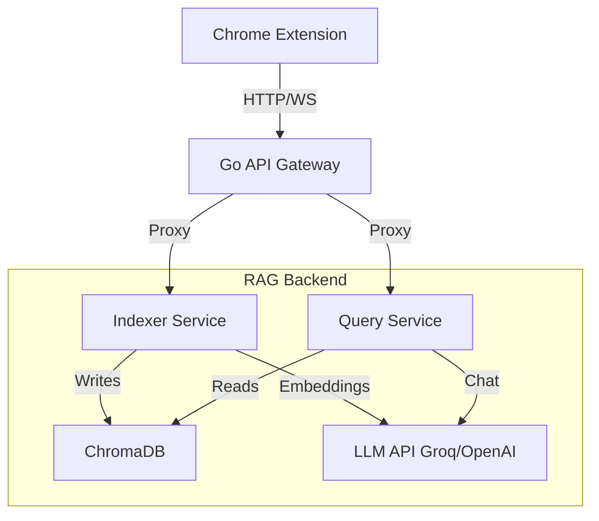

# CodeLens AI

**"Chat with your Code"** – An intelligent, privacy-focused RAG (Retrieval-Augmented Generation) system that lets you ask questions about your codebase directly from your browser.


## 📖 Introduction

CodeLens AI enables developers to gain deep insights into their repositories without leaving the browser. It indexes your codebase, understands the structure using robust parsing, and allows you to query it using natural language. Whether you're onboarding to a new project or debugging a complex issue, CodeLens acts as your AI pair programmer with full context of your code.

## 🏗️ Architecture Overview

The system allows for a modular microservices architecture, ensuring scalability and separation of concerns.



### Components

1.  **Chrome Extension**: The frontend interface. A React-based side panel that sits in your browser, allowing you to trigger indexing and chat with the AI.
2.  **API Gateway (Go)**: The entry point. Handles authentication, rate limiting, and routes requests to the appropriate backend service.
3.  **Indexer Service (Python)**: The "Reader". Clones repositories, parses code using Tree-sitter to understand syntax (classes, functions), and generates vector embeddings stored in ChromaDB.
4.  **Query Service (Python)**: The "Thinker". Takes your question, searches the vector database for relevant code snippets, and constructs a context-aware prompt for the LLM to provide an accurate answer.

## 🚀 Quick Start

### Prerequisites

*   [Docker](https://www.docker.com/) & Docker Compose
*   [Node.js](https://nodejs.org/) (for extension development)
*   [Go](https://go.dev/) (optional, for gateway development)
*   API Keys:
    *   **OpenAI** (or compatible) for Embeddings.
    *   **Groq** (or OpenAI) for high-speed inference.

### Installation

1.  **Clone the Repository**
    ```bash
    git clone https://github.com/yourusername/codelens-ai.git
    cd codelens-ai
    ```

2.  **Environment Setup**
    Create a `.env` file in the root directory (copy from `.env.example`):
    ```bash
    cp .env.example .env
    ```
    Populate it with your keys:
    ```env
    OPENAI_API_KEY=sk-...
    GROQ_API_KEY=gsk_...
    JWT_SECRET=super-secure-secret
    ```

3.  **Start the Backend**
    Run the services using Docker Compose:
    ```bash
    docker-compose up --build
    ```
    This will spin up:
    *   Gateway at `http://localhost:8080`
    *   Indexer at `http://localhost:8001`
    *   Query Service at `http://localhost:8002`

4.  **Load the Extension**
    1.  Navigate to `extension/` and install dependencies:
        ```bash
        cd extension
        npm install
        npm run build
        ```
    2.  Open Chrome and perform the following: `chrome://extensions/`
    3.  Enable **Developer mode** (top right).
    4.  Click **Load unpacked** and select the `extension/dist` folder.

## 💡 Usage Guide

### 1. Indexing a Repository
Open the CodeLens side panel on any GitHub repository page.
*   Click the **"Index Repo"** button.
*   The extension sends the repo URL to the Gateway -> Indexer.
*   Top-level progress bars will show the status of Cloning, Parsing, and Embedding.

### 2. Chatting with Code
Once indexed, switch to the **Chat** tab.
*   Ask: *"How does the authentication middleware work?"*
*   The Query service retrieves the relevant `auth.go` or `middleware.py` chunks.
*   The LLM generates an answer referencing the specific files and lines of code.

## 🔍 Deep Dive

### 🛡️ Go API Gateway
Located in `/gateway`.
*   **Tech**: Go, Fiber (Web Framework).
*   **Role**: It's the security guard and traffic controller.
*   **Key Features**:
    *   **JWT Authentication**: Secures endpoints so only authorized users/extensions can access the backend.
    *   **Reverse Proxy**: Forwards `/api/v1/index` to the Indexer and `/api/v1/query` to the Query service.
    *   **CORS**: Handles Cross-Origin Resource Sharing for the browser extension.

### 🧠 RAG Server (Indexer & Query)
Located in `/services`.

#### Indexer Service (`/services/indexer`)
*   **Tech**: Python, FastAPI, Tree-sitter, LangChain (optional).
*   **Process**:
    1.  **Clone**: Temporarily clones the target git repository.
    2.  **Parse**: Uses **Tree-sitter** to generate an Abstract Syntax Tree (AST). This allows it to chunk code intelligently (by function or class) rather than arbitrarily splitting text.
    3.  **Embed**: Converts these code chunks into vector representations using an embedding model (e.g., `text-embedding-3-small`).
    4.  **Store**: Saves vectors into **ChromaDB** with metadata (filepath, line numbers).

#### Query Service (`/services/query`)
*   **Tech**: Python, FastAPI, ChromaDB.
*   **Process**:
    1.  **Embed Query**: Converts your user question into a vector.
    2.  **Similarity Search**: Finds the "nearest neighbors" in ChromaDB—these are the code snippets most semantically related to your question.
    3.  **Generation**: Sends the question + retrieved code snippets (Context) to the LLM (Groq/OpenAI).
    4.  **Response**: Streams the answer back to the user.

### 🧩 Chrome Extension
Located in `/extension`.
*   **Tech**: React, Vite, TypeScript, TailwindCSS.
*   **Structure**:
    *   `manifest.json`: Defines permissions (sidePanel, activeTab) and host permissions.
    *   `src/sidepanel`: The main UI logic. Uses `zustand` for state management.
    *   `src/components`: Reusable UI components (ChatInterface, IndexStatus).

## 🛠️ Development

To run services individually without Docker (for debugging):

**Gateway**:
```bash
cd gateway
go run cmd/gateway/main.go
```

**Indexer**:
```bash
cd services/indexer
pip install -r requirements.txt
uvicorn app.main:app --port 8001
```

**Query**:
```bash
cd services/query
pip install -r requirements.txt
uvicorn app.main:app --port 8002
```

---

Made with ❤️ by CodeLens Team.

<!-- Updated -->
<!-- Updated -->
<!-- Updated -->
<!-- Updated -->