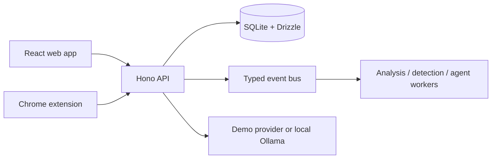

# CodeLens

CodeLens is a local-first engineering platform for code intelligence and evidence-backed incident investigation. It connects the engineering loop from repository analysis through a deterministic incident demo, while keeping mutating remediation behind explicit human approval.

The core local demo loop is implemented: React product shell, Hono API, SQLite/Drizzle persistence, deterministic incident replay, correlated alerts, persisted agent evidence, and approval-gated demo remediation. Repository analysis supports bounded static checks for JavaScript, TypeScript, Python, and Java; optional Ollama adds a local summary.

Repository analysis persists indexed file content, deterministic file summaries, and resolved local import edges. In the repository detail page, select an indexed file to inspect its source and ask a file-scoped question. The API returns the source files used for each answer. See [GitHub monitoring setup](docs/github-integration.md) for signed webhook intake and the current write-capability boundary.

## Architecture



The API owns domain state and validates all boundary input. Deterministic tools and persisted evidence are the planned sources of truth; an LLM only interprets those facts. The in-memory event bus uses a replaceable interface so a durable local broker can be introduced without coupling application domains to transport.

## Run locally

Prerequisites: Node.js 20+, pnpm 9+, and optionally Docker Desktop.

```bash
pnpm install
pnpm run setup
pnpm dev
```

Open `http://localhost:3000`; the API listens on `http://localhost:4000`. The default `AI_PROVIDER=demo` needs no API key, account, or network call. To use a local model, install Ollama, set `AI_PROVIDER=ollama`, and configure `OLLAMA_MODEL` in `.env`.

Or use Docker:

```bash
docker compose up --build
```

`pnpm run setup` intentionally runs migrations before seeding. The demo seed creates services, a deployment regression incident, its timeline, and investigation hypotheses. It is not safe to run repeatedly against a populated database because seed records are additive.

## Commands

| Command | Purpose |
| --- | --- |
| `pnpm dev` | Start the web app and API |
| `pnpm run setup` | Create the local schema and demo data |
| `pnpm typecheck` | Type-check all workspace packages |
| `pnpm build` | Build workspace packages |
| `pnpm db:migrate` | Create database tables |
| `pnpm db:seed` | Add demo records |

## API surface

All platform endpoints are versioned under `/api/v1`.

- `POST /auth/register`, `POST /auth/login`, `GET /auth/me`
- `GET|POST /repositories`, `GET /repositories/:id`, `POST /repositories/:id/analyze`
- `GET /dashboard`, `GET /services`, `GET /incidents`, `GET /agents/runs`, `GET /evaluations`
- `POST /incidents/:id/approval` requires a bearer token and records the human decision.

The legacy extension-compatible `/index`, `/query`, `/analyze`, and `/symbols` endpoints are maintained while the Code Intelligence worker is added. They do not claim an unavailable static-analysis result.

## $0 cost stance

Core development is fully local: SQLite, Hono, React, Ollama (optional), and the deterministic demo provider. No commercial LLM or cloud service is required. See [free deployment guidance](docs/free-deployment.md), [cost safety controls](docs/cost-safety.md), and the [cost audit](docs/cost-audit.md) before enabling a public demo.

## Current roadmap

1. Add deterministic repository analysis for TypeScript, JavaScript, Python, and Java.
2. Build the service simulator and telemetry/detection pipeline.
3. Replace the in-process event boundary with a durable worker or broker for multi-process deployments.
4. Add an account UI before exposing non-demo remediation to users.

The architecture and tradeoffs are documented in [the system-design guide](docs/architecture/system-design.md), [ADRs](docs/architecture), and the [two-minute recruiter demo](docs/demo-guide.md).
